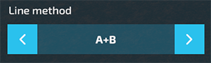
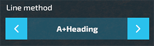
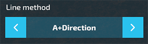

# Guidance Steering for Farming Simulator 22 (GPS)

 

## Publishing
Only Wopster is allowed to publish any of this code as a mod to any mod site, or file sharing site. The code is open for your own use, but give credit where due. I will not accept support for any 'version' of Guidance Steering that is obtained from a sketchy mod page. Versioning is controlled by me and not by any other page. This confuses people and really holds back the development which results in no fun for me!

## Warning!
Please be aware that this is a ***DEVELOPMENT VERSION***!
* The development version can break the game or your savegame!
* The development version doesn´t support the full feature package yet!

#### Multiplayer
This version should also work in Multiplayer, but keep in mind it might have bugs.

## Installation / Releases
Currently the development version is only available via GitHub. When a official release version is avaiable you can download the latest version from the [release section](https://github.com/stijnwop/guidanceSteering/releases).

> _Please note: if there's no release version available it means there's no official release yet._

All official releases will be avaiable at the offical Farming Simulator ModHub.

For installing the release:

Windows: Copy the `FS22_guidanceSteering_dev.zip` into your `My Games\FarmingSimulator2022\mods` directory.

## Developers version
To quickly build a zip of the developer version without the needed extras, use the `zip.bat` included in this repository.

> _Please note: the batch file requires an installed version of 7-Zip or Winrar_

## Documentation

### Buying GPS
To be able to use Guidance Steering you first need to buy the GPS technology for your vehicle. Either buy a new vehicle and add the GPS configuration or drive your current vehicle to a workshop and configure it.

### Toggle Guidance Steering
When you buy the GPS configuration for the first time Guidance Steering is disabled.

Turn Guidance Steering on and off with `Alt + C`.

### Open the menu
Open the menu with `Ctrl + S`. Make sure that you have Guidance Steering enabled first!

### Setting up the guidance line

#### AB Straight line
The AB mode requires two points (A and B) in order to calculate the angle to generate the line.

First, select the A+B method in the menu.

1. Drive to the location where you want to setup your lines.
2. Hit `Alt + E` once (or use the menu) to reset the AB line creation.
3. Hit `Alt + E` once more (or use the menu) to set point A.
4. Drive a 15 metres away from point A and hit `Alt + E` once more (or use the menu) to set point B and create the track.

#### A+Heading line
The A+Heading mode requires only point A and a cardinal heading to generate the line.

First select the A+Heading method in the menu.

1. Drive to the location where you want to setup your lines.
2. Hit `Alt + E` once (or use the menu) in order to reset the A+Heading creation.
3. Hit `Alt + E` once more (or use the menu) in order to set point A.
4. Enter the desired cardinal heading in degrees. For example, enter 0 degrees for North or 90 degrees for East.
5. Press 'Set Cardinal' to create the guidance line.
  
> Tip: If most of your fields are North-South or East-West, create one A+Heading track and use rotate track (`Alt + End`) to rotate the track back and forth between North-South and East-West.

#### A+Direction line
The A+Direction mode requires only Point A and it takes the cardinal heading from the direction the vehicle is pointing.

First select the A+Direction method in the menu.

1. Drive to the location where you want to setup your lines.
2. Point the vehicle in the direction desired for the guidance line and hit `Alt + E` once (or use the menu) to set the line.
3. If 'Snap terrain angle' is enabled in the settings, it will snap to the closest angle to create the guidance line, otherwise it will create a guidance line matching the direction of the vehicle.

### Auto width
Hit `Alt + R` (or use the menu) to detect the width of your vehicle.
Unfold and lower the vehicle to get the best results.

### Increase/descrease width
Hit `Alt + Equals` and `Alt + Minus` to manually change the width. Set the width increment in the menu to speed up the process.

> _Please note that this only works after the track creation!_

### Offset line
If you use an implement such as a plow that is offset to one side, you can set an offset in the menu. For most implements, the offset will be detected automatically when setting the implement width.

If the offset is not `0`, it will appear as a red line. Use the increment width select box (the one at the top) to set the increment and click `Increment offset` to offset your line. If you set the increment to negative it will flip the offset.

### Shift track
Shift the track left and right using `Alt + Page Up` and `Alt + Page Down`. Hold down the key to speed up shifting the track.

### Realign track
Realign the active track to the vehcile position using `Alt + Home`. It will also reset the lane counter displayed on the GPS icon.

### Rotate track
To rotate the track 90 degrees, enter the strategy menu and hit the 90 degree button or use `Alt + End`.

### Snap Terrain Angle
Enable Snap terrain in the menu to help create straight lines that align with the terrain.

### Toggle guidance steering
Once a track is created hit `Alt + X` to toggle guidance steering on or off. Guidance will also disengage if the vehicle is manually steered off the guidance line.

### Toggle guidance line display
Toggle the guidance line display using `Alt + L` or the 'Show lines' setting in the menu. Change the 'Show as dots' setting in the menu to toggle between dotted or regular lines.

### Headland Management
Use the 'Headland mode' and 'Headland act distance' settings to change the interaction with the headland.

When Headland mode is set to `Stop`, the vehicle will stop at the set interaction distance from the edge of the field.

When set to `Off` the vehicle will only warn you with an audible beep at the set interaction distance and will continue driving.

### Store and load tracks
Store and load tracks using the second page in the menu.
This is also an easy way to share track data with other players in multiplayer.

There an option to save tracks per farm, this means that the track will only be available for farm that owns the vehicle. When this settings is turned off the track is accessible to everyone.

### Visuals
On base game John Deere vehicles the StarFire™ GPS receiver visibility is toggled on when you buy the GPS system.

If you want the same effect on your mod vehicles you can add the configuration yourself in the xml for the vehicle. Replace `NODE_NAME` with the appropriate node id from the i3dMapping references that will be toggled when purchasing the GPS system:

~~~xml
<globalPositioningSystemConfigurations>
  <globalPositioningSystemConfiguration name="$l10n_ui_no" price="0">
          <objectChange node="NODE_NAME" visibilityActive="false" visibilityInactive="true" />
  </globalPositioningSystemConfiguration>
  <globalPositioningSystemConfiguration name="$l10n_ui_yes" price="15000">
          <objectChange node="NODE_NAME" visibilityActive="true" visibilityInactive="false" />
  </globalPositioningSystemConfiguration>
</globalPositioningSystemConfigurations>
~~~

## Copyright
Copyright (c) 2022 [Wopster](https://github.com/stijnwop).
All rights reserved.

Special thanks to workflowsen for creating the icon!
